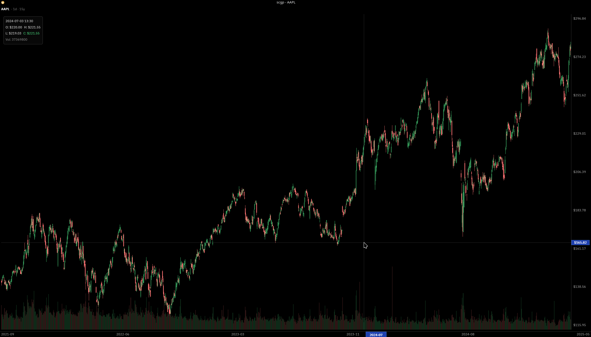

# scgp

Standalone GPU-accelerated candlestick chart viewer. Pulls market data from Yahoo Finance and renders interactive charts using [GPUI](https://github.com/zed-industries/zed/tree/main/crates/gpui).



## Features

- Canvas-based candlestick rendering with volume bars
- Smooth zoom (scroll wheel) with cursor-anchored scaling
- Drag panning across historical data
- Crosshair with OHLCV tooltip
- Price and time axes with cursor tracking labels
- Switch tickers on the fly (Escape to open input)
- Configurable interval, range, and window size via CLI

## Installation

```sh
cargo install --git https://github.com/7jrxt42BxFZo4iAnN4CX/scgp
```

Or build from source:

```sh
git clone https://github.com/7jrxt42BxFZo4iAnN4CX/scgp
cd scgp
cargo build --release
```

The binary will be at `target/release/scgp`.

## Usage

```
scgp -t AAPL
scgp -t MSFT -i 1h -r 5d
scgp -t TSLA -i 5m -r 1d -s 2560x1440
scgp -t BTC-USD -m
```

### CLI arguments

| Flag | Long | Default | Description |
|------|------|---------|-------------|
| `-t` | `--ticker` | *required* | Ticker symbol (e.g. AAPL, MSFT, BTC-USD) |
| `-i` | `--interval` | `1d` | Candle interval (1d, 1h, 5m, etc.) |
| `-r` | `--range` | `1y` | Data range (1y, 6mo, 1mo, 5d, 1d, etc.) |
| `-s` | `--size` | `1920x1080` | Window size WxH |
| `-m` | `--maximized` | `false` | Maximize window |

## Keybindings

| Key | Action |
|-----|--------|
| Escape | Toggle ticker input dialog |
| Scroll wheel | Zoom in/out (anchored to cursor) |
| Left mouse drag | Pan through data |

## Building from source

### Prerequisites

- Rust 2024 edition (1.85+)
- System dependencies required by GPUI:
  - **Linux**: `libxcb`, `libxkbcommon`, `libwayland`, `vulkan-loader` and related dev packages
  - **macOS**: Xcode command line tools

```sh
cargo build --release
```

## License

[MIT](LICENSE)
